## Topic Structure

* **historian** [time series data]: Sparkplug B
* **kv** [non-time series data]: Key-Value
* **blob** [files]: Binary Large Object

```mermaid
flowchart LR;
    B[mfi-v1.0];
    B --> C[historian] --> F["enterprise"];
    B --> D[kv] --> F;
    B --> E[blob] --> F;
    F --> G["site*"];
    G --> H["area*"];
    H --> I["device*"];
    I --> X["..."];
    F --> X;
    G --> X;
    H --> X;


    classDef highlight fill:#094d57
    class A,B,C,D,E highlight
```

> \*  `site`, `area`, and `device` are optional placeholders for the actual values of the enterprise, site, area, and device.

Examples: 
* `mfi-v1.0-kv/CMU/Mill19/Mezzanine-Lab/yk-destroyer/#`
* `mfi-v1.0-historian/CMU/Mill19/HAAS-UMC750/#`
