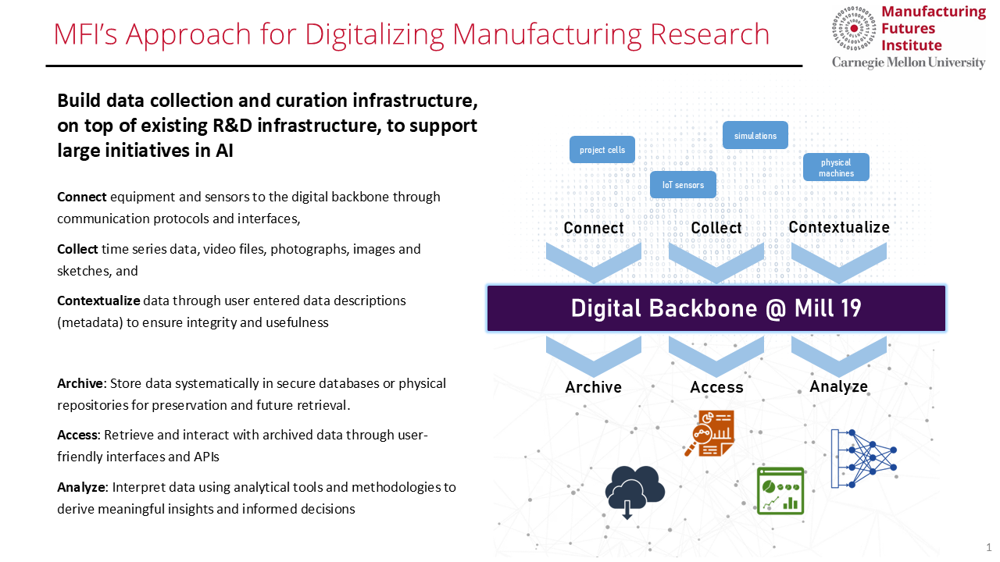

## Introduction

The <b>Manufacturing Futures Institute</b> at Carnegie Mellon University has embarked on a mission to become a leader in the digital transformation of manufacturing.  Carnegie Mellon engineers and scientists are building the foundational technology infrastructure at Mill 19 and the university that will support and enable data-driven advanced manufacturing research for decades to come.
Commonly known as a digital backbone, this foundational infrastructure for connecting, collecting and contextualizing research data generated throughout the Mill 19 facility will enable researchers to build, apply and leverage curated and trusted data sources for the transformation of manufacturing. This same foundational infrastructure provides a platform upon which comprehensive virtual representations of equipment, processes, products and materials can be built to mirror their physical counterparts, creating “digital twins”, in real-time or near-real-time.

### Build data collection and curation infrastructure, on top of existing R&D infrastructure, to support large initiatives in AI 

<b>Connect</b> equipment and sensors to the digital backbone through communication protocols and interfaces,  
Collect time series data, video files, photographs, images and sketches, and  
Contextualize data through user entered data descriptions (metadata) to ensure integrity and usefulness 

<b>Archive:</b> Store data systematically in secure databases or physical repositories for preservation and future retrieval.  
<b>Access:</b> Retrieve and interact with archived data through user-friendly interfaces and APIs 
<b>Analyze:</b> Interpret data using analytical tools and methodologies to derive meaningful insights and informed decisions 

