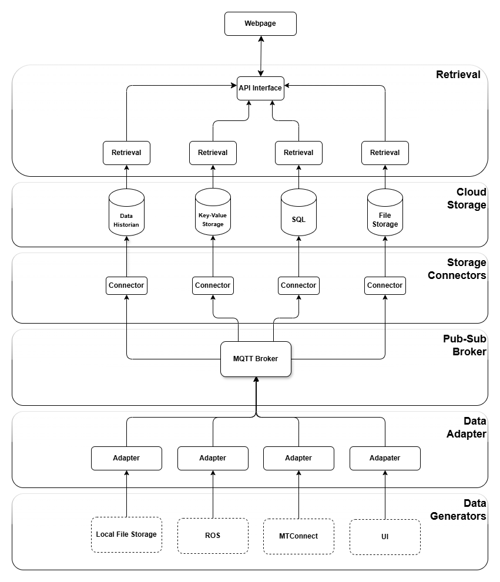

# Overview

## What is the Digital Data Backbone?

The **Digital Data Backbone (DDB)** is a comprehensive Python-based framework for streaming data from various sources to the MFI Digital Data Backbone. It provides tools for data ingestion, metadata storage, and retrieval services — enabling seamless ingestion of real-time data from diverse sources including IoT sensors, file systems, and MQTT brokers into a central pub-sub messaging system.

### Core Capabilities

- **Connect**: Equipment and sensors to the digital backbone through communication protocols and interfaces.
- **Collect**: Time series data, video files, photographs, images and sketches from manufacturing equipment.
- **Contextualize**: Data through user entered data descriptions (metadata) to ensure integrity and usefulness.

## Architecture at a Glance

The DDB follows an event-driven architecture using MQTT as the central pub-sub broker.

Data flows from **Data Adapters** → **MQTT Broker** → **Database Nodes**. Each component is independently configurable and pluggable.

## Key Components

| Component | Description | Repository |
|-----------|-------------|------------|
| **Core Library** | Python package providing data adapters, streamers, and topic families | [`mfi_ddb_package`](https://github.com/cmu-mfi/mfi_ddb_library/tree/main/mfi_ddb_package) |
| **Data Adapter App** | REST API web application for managing data adapters on edge devices | [`mfi_ddb_data_adapter`](https://github.com/cmu-mfi/mfi_ddb_library/tree/main/mfi_ddb_data_adapter) |
| **Database Nodes** | Compatible database storage implementations | [`mfi_ddb_database_nodes`](https://github.com/cmu-mfi/mfi_ddb_library/tree/main/mfi_ddb_database_nodes) |
| **Retrieval API** | Metadata store and REST API for data queries | [`mfi_ddb_retrieval_api`](https://github.com/cmu-mfi/mfi_ddb_library/tree/main/mfi_ddb_retrieval_api) |

## Who Is This For?

- **Researchers** who need to collect and analyze manufacturing data
- **Engineers** building data collection infrastructure for production environments
- **Integrators** connecting existing equipment to digital systems
- **Operators** managing dashboards and monitoring production metrics
