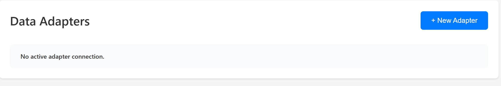

# User Instructions

### Adapter UI Installation Instructions

### Streaming Data

The data adapter library is located at:

`C:/repos/mfi-ddb_library`

Inside this directory, you will find a `README` file containing the currently installed version and troubleshooting information if you encounter issues.

---

## Creating a New Connection

Connections are created through the **webpage interface**.

### Step 1 – Landing Page

When you open the UI, you will be taken to the **Landing Page**. This page displays the Data Adapters section. If there are no active connections, it will show the message **"No active adapter connection"** along with a prompt to click **+ New Adapter**. The + New Adapter button in blue is located at the top-right corner, which you will click to start creating a new adapter. The **server status** is shown in the top-right corner (red indicates offline, green indicates online).

If no adapters are connected, the page will display the message: _"No active adapter connection"_ along with a prompt to create one.

---

### Step 2.1 – Adapter Configuration

Clicking **New Adapter** opens a pop-up window where you can configure your connection:

- **Connection Type**: Choose from a list of supported adapters.
- **Topic Family**: Select the topic family for the data stream.
- **Configuration(YAML)**:
  - Automatically populated for some adapter types (e.g., MTConnect defaults to _Historian_ topic family).
  - Editable so you can adjust it for your device or streaming needs.

You have two ways to provide the YAML configuration:

1. Edit the text directly in the input box.
2. Upload a YAML file from your computer.

The configuration is validated in real-time. Only valid configurations enable the **Save** button.

---

### Step 2.2 – MQTT Broker Configuration

Below the YAML configuration, you will find the **MQTT Broker Configuration** section.

- This section is pre-filled with default broker details used for data streaming.
- You can modify the broker address, port, enterprise/site information, credentials, and security settings (e.g., TLS) to match your environment.

Once both the YAML and MQTT configurations are valid, click **Save** to connect the adapter.

---

### Step 3 – Example: MTConnect Adapter

If you select **MTConnect** as your adapter type from the dropdown:

- The **Topic Family** will be set to _Historian_ by default.
- The **Configuration (YAML)** will be automatically populated with MTConnect-specific fields such as:
  - `agent_ip`
  - `agent_url`
  - `device_name`
  - `trial_id`
- You can edit these fields to match your MTConnect agent setup.
- A **Config Help** icon (question mark) is available — tooltip will explain what each MTConnect field does and how to fill it.

Once configured and saved:

1. The system will validate the MTConnect configuration.
2. It will establish the connection to your MTConnect agent.
3. Data will begin streaming via the configured MQTT broker.
4. The adapter will appear on the landing page, and the **status indicator** will turn **green** when streaming is active.

## 

You can similarly add "N" number of connections and stream them at once.

## Actions on a Connected Adapter

Once an adapter is connected and streaming, you can perform the following actions directly from the landing page:

Each action button is available in the adapter card on the landing page, so you can manage connections without navigating away.

## New Adapter

- **Edit** – Reopen the configuration modal to update the YAML or MQTT broker settings.
- **Pause** – Temporarily stop data streaming without disconnecting the adapter.
- **Resume/Play** – Restart streaming after it has been paused, using the existing configuration.

## New Adapter 

- **Delete** – Disconnect the adapter and remove it from the active connections list.

## Delete Adapter

Delete would remove the adapter from the list but wont affect the streaming of other adapters in the list

## Error Handling

When the server goes down you see :

## 

At times when the adapter can't be reached, UI throws an **"Adapter not connected"** error. Check logs to catch the issue.
